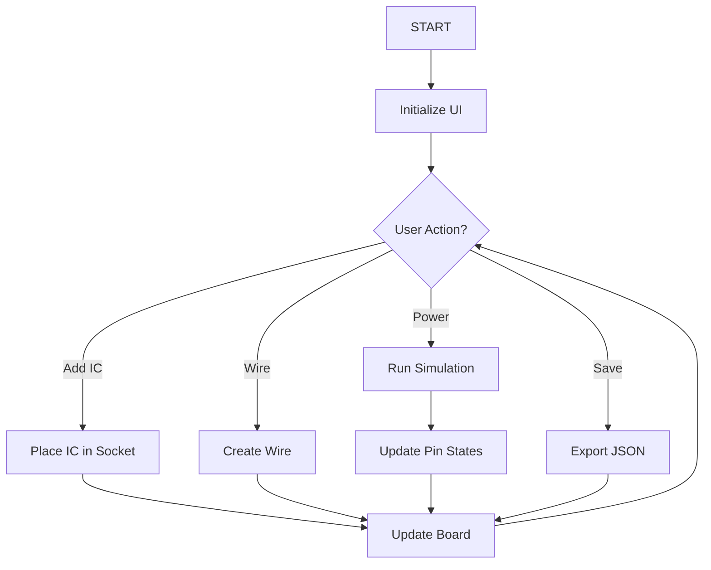

# WebIC-Trainer Flowchart

```mermaid
graph TD
    A["START"] --> B["Initialize UI"]
    B --> C{User Action?}
    C -->|Add IC| D["Place IC in Socket"]
    C -->|Wire| E["Create Wire"]
    C -->|Power| F["Run Simulation"]
    C -->|Save| G["Export JSON"]
    D --> H["Update Board"]
    E --> H
    F --> I["Update Pin States"]
    I --> H
    G --> H
    H --> C
```
